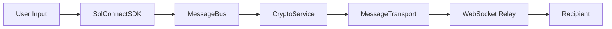

# Self-Updating Knowledge Infrastructure

## Living Documentation System

### Auto-Generated Architecture Documentation
```typescript
interface ArchitectureDoc {
  lastUpdated: Date;
  components: ComponentMap;
  relationships: RelationshipGraph;
  dataFlow: DataFlowDiagram;
  patterns: ArchitecturalPattern[];
  metrics: PerformanceMetrics;
}

class ArchitectureDocGenerator {
  async generateLivingDocs(): Promise<void> {
    const docs = {
      overview: await this.generateOverview(),
      components: await this.analyzeComponents(),
      dataFlow: await this.mapDataFlow(),
      patterns: await this.extractPatterns(),
      dependencies: await this.analyzeDependencies(),
      performance: await this.gatherMetrics()
    };
    
    await this.updateDocumentation(docs);
    await this.generateVisualizations(docs);
  }
  
  async analyzeComponents(): Promise<ComponentMap> {
    const components = new Map();
    
    // Scan SolConnect service files
    const serviceFiles = await glob('src/services/**/*.ts');
    for (const file of serviceFiles) {
      const analysis = await this.analyzeFile(file);
      components.set(analysis.name, {
        file,
        purpose: analysis.purpose,
        dependencies: analysis.dependencies,
        exports: analysis.exports,
        complexity: analysis.complexity,
        lastModified: analysis.lastModified
      });
    }
    
    // Scan React components
    const componentFiles = await glob('src/components/**/*.tsx');
    for (const file of componentFiles) {
      const analysis = await this.analyzeReactComponent(file);
      components.set(analysis.name, {
        file,
        type: 'react-component',
        props: analysis.props,
        hooks: analysis.hooks,
        dependencies: analysis.dependencies,
        complexity: analysis.complexity
      });
    }
    
    return components;
  }
}
```

### Auto-Updating Integration Guides
```markdown
# SolConnect Integration Guide (Auto-Generated)
*Last updated: ${new Date().toISOString()}*

## Message Flow Pipeline
*Automatically extracted from codebase analysis*



### Current Active Components
${components.map(c => `- **${c.name}**: ${c.purpose} (${c.lastModified})`).join('\n')}

### Integration Patterns Detected
${patterns.map(p => `- **${p.name}**: Used in ${p.usageCount} places`).join('\n')}
```

### Dynamic Context-Aware Documentation
```typescript
class ContextAwareDocs {
  async generateContextualDocs(userQuery: string): Promise<Documentation> {
    const context = await this.analyzeQuery(userQuery);
    
    if (context.type === 'integration') {
      return await this.generateIntegrationDocs(context);
    } else if (context.type === 'troubleshooting') {
      return await this.generateTroubleshootingDocs(context);
    } else if (context.type === 'implementation') {
      return await this.generateImplementationDocs(context);
    }
    
    return await this.generateGeneralDocs(context);
  }
  
  async generateIntegrationDocs(context: Context): Promise<Documentation> {
    const relevantComponents = await this.findRelevantComponents(context.keywords);
    const integrationPatterns = await this.findIntegrationPatterns(relevantComponents);
    const codeExamples = await this.generateCodeExamples(integrationPatterns);
    
    return {
      title: `How to integrate ${context.primaryComponent}`,
      sections: [
        {
          title: 'Overview',
          content: await this.generateOverview(relevantComponents)
        },
        {
          title: 'Step-by-step Integration',
          content: await this.generateStepByStep(integrationPatterns)
        },
        {
          title: 'Code Examples',
          content: codeExamples
        },
        {
          title: 'Common Patterns',
          content: await this.generatePatternDocs(integrationPatterns)
        }
      ]
    };
  }
}
```

### Self-Improving Pattern Library
```typescript
interface PatternEvolution {
  pattern: Pattern;
  usage: UsageStatistics;
  evolution: EvolutionHistory;
  effectiveness: EffectivenessMetrics;
}

class PatternLibrary {
  private patterns: Map<string, PatternEvolution> = new Map();
  
  async updatePatternFromUsage(patternId: string, usage: PatternUsage): Promise<void> {
    const evolution = this.patterns.get(patternId);
    if (!evolution) return;
    
    // Update usage statistics
    evolution.usage.totalUsages++;
    evolution.usage.successRate = this.calculateSuccessRate(evolution.usage);
    evolution.usage.averageImplementationTime = this.updateAverageTime(evolution.usage, usage.implementationTime);
    
    // Track effectiveness
    evolution.effectiveness.codeQuality = this.updateQualityMetric(evolution.effectiveness, usage.qualityScore);
    evolution.effectiveness.performanceImpact = this.updatePerformanceMetric(evolution.effectiveness, usage.performanceImpact);
    
    // Evolve the pattern if needed
    if (this.shouldEvolvePattern(evolution)) {
      evolution.pattern = await this.evolvePattern(evolution.pattern, usage);
      evolution.evolution.versions.push({
        version: evolution.evolution.versions.length + 1,
        changes: await this.identifyChanges(evolution.pattern, usage),
        reason: await this.identifyEvolutionReason(usage),
        timestamp: new Date()
      });
    }
    
    await this.persistPattern(evolution);
  }
  
  async generatePatternDocs(): Promise<string> {
    let docs = '# SolConnect Patterns (Auto-Generated)\n\n';
    
    for (const [id, evolution] of this.patterns) {
      docs += `## ${evolution.pattern.name}\n`;
      docs += `*Success Rate: ${evolution.usage.successRate}% | Used ${evolution.usage.totalUsages} times*\n\n`;
      docs += `${evolution.pattern.description}\n\n`;
      
      docs += '### When to Use\n';
      docs += evolution.pattern.criteria.map(c => `- ${c}`).join('\n') + '\n\n';
      
      docs += '### Implementation\n';
      docs += '```typescript\n';
      docs += evolution.pattern.template + '\n';
      docs += '```\n\n';
      
      docs += '### Real Examples\n';
      const examples = await this.findRealExamples(id);
      docs += examples.map(e => `- ${e.file}:${e.line} - ${e.description}`).join('\n') + '\n\n';
    }
    
    return docs;
  }
}
```

### Auto-Generated Best Practices
```typescript
class BestPracticesGenerator {
  async generateBestPractices(): Promise<BestPracticesDoc> {
    const analysis = await this.analyzeCodebase();
    const sessions = await this.getRecentSessions();
    const patterns = await this.getSuccessfulPatterns();
    
    return {
      encryption: await this.generateEncryptionBestPractices(analysis.crypto),
      performance: await this.generatePerformanceBestPractices(analysis.performance),
      testing: await this.generateTestingBestPractices(analysis.tests),
      architecture: await this.generateArchitecturalBestPractices(patterns),
      deployment: await this.generateDeploymentBestPractices(sessions)
    };
  }
  
  async generateEncryptionBestPractices(cryptoAnalysis: CryptoAnalysis): Promise<string> {
    const practices = [];
    
    // Analyze successful encryption implementations
    const successfulPatterns = cryptoAnalysis.successfulImplementations;
    practices.push('## Encryption Best Practices\n');
    
    if (successfulPatterns.find(p => p.uses('ChaCha20-Poly1305'))) {
      practices.push('- ✅ Use ChaCha20-Poly1305 for symmetric encryption (proven successful in ' + 
                    successfulPatterns.filter(p => p.uses('ChaCha20-Poly1305')).length + ' implementations)');
    }
    
    if (successfulPatterns.find(p => p.uses('X25519'))) {
      practices.push('- ✅ Use X25519 for key exchange (high success rate in our implementations)');
    }
    
    // Analyze common issues
    const commonIssues = cryptoAnalysis.commonIssues;
    practices.push('\n### Common Pitfalls to Avoid\n');
    commonIssues.forEach(issue => {
      practices.push(`- ❌ ${issue.description} (caused ${issue.frequency} issues)`);
    });
    
    return practices.join('\n');
  }
}
```

### Living Architecture Diagrams
```typescript
class ArchitectureDiagramGenerator {
  async generateLivingDiagrams(): Promise<void> {
    const components = await this.analyzeComponents();
    const relationships = await this.analyzeRelationships();
    
    // Generate Mermaid diagrams
    const systemOverview = this.generateSystemOverview(components, relationships);
    const messageFlow = this.generateMessageFlowDiagram(components);
    const dataFlow = this.generateDataFlowDiagram(components);
    
    // Update documentation files
    await this.updateDiagramFile('docs/architecture/system-overview.md', systemOverview);
    await this.updateDiagramFile('docs/architecture/message-flow.md', messageFlow);
    await this.updateDiagramFile('docs/architecture/data-flow.md', dataFlow);
    
    // Generate component dependency graphs
    for (const component of components) {
      const componentDiagram = this.generateComponentDiagram(component);
      await this.updateDiagramFile(`docs/components/${component.name}.md`, componentDiagram);
    }
  }
  
  generateSystemOverview(components: Component[], relationships: Relationship[]): string {
    let diagram = '```mermaid\ngraph TD\n';
    
    // Add components
    components.forEach(component => {
      const style = this.getComponentStyle(component.type);
      diagram += `    ${component.id}[${component.name}]${style}\n`;
    });
    
    // Add relationships
    relationships.forEach(rel => {
      diagram += `    ${rel.from} --> ${rel.to}\n`;
    });
    
    diagram += '```\n';
    
    return this.wrapWithMetadata(diagram, 'System Overview', new Date());
  }
  
  private wrapWithMetadata(diagram: string, title: string, lastUpdated: Date): string {
    return `# ${title}
*Auto-generated on ${lastUpdated.toISOString()}*

${diagram}

## Components Overview
${this.generateComponentList()}

## Last Analysis
- **Total Components**: ${this.components.length}
- **Integration Points**: ${this.relationships.length}
- **Complexity Score**: ${this.calculateComplexityScore()}
`;
  }
}
```

### Intelligent Documentation Updates
```typescript
class IntelligentDocUpdater {
  async onCodeChange(changedFiles: string[]): Promise<void> {
    for (const file of changedFiles) {
      const impact = await this.analyzeImpact(file);
      
      // Update relevant documentation
      if (impact.affectsArchitecture) {
        await this.updateArchitectureDocs(impact);
      }
      
      if (impact.affectsAPI) {
        await this.updateAPIDocs(impact);
      }
      
      if (impact.affectsIntegration) {
        await this.updateIntegrationGuides(impact);
      }
      
      if (impact.addsPatternsOrExamples) {
        await this.updatePatternLibrary(impact);
      }
    }
  }
  
  async updateAPIDocs(impact: ImpactAnalysis): Promise<void> {
    const apiChanges = await this.extractAPIChanges(impact.file);
    
    for (const change of apiChanges) {
      if (change.type === 'new-method') {
        await this.addMethodDocumentation(change);
      } else if (change.type === 'modified-signature') {
        await this.updateMethodDocumentation(change);
      } else if (change.type === 'deprecated') {
        await this.addDeprecationNotice(change);
      }
    }
  }
  
  async addMethodDocumentation(change: APIChange): Promise<void> {
    const method = change.method;
    const documentation = await this.generateMethodDocs(method);
    
    // Find the appropriate documentation file
    const docFile = await this.findDocumentationFile(method.className);
    
    // Insert documentation in the right place
    await this.insertDocumentation(docFile, documentation, method);
    
    // Update examples and usage guides
    await this.updateUsageExamples(method);
  }
}
```